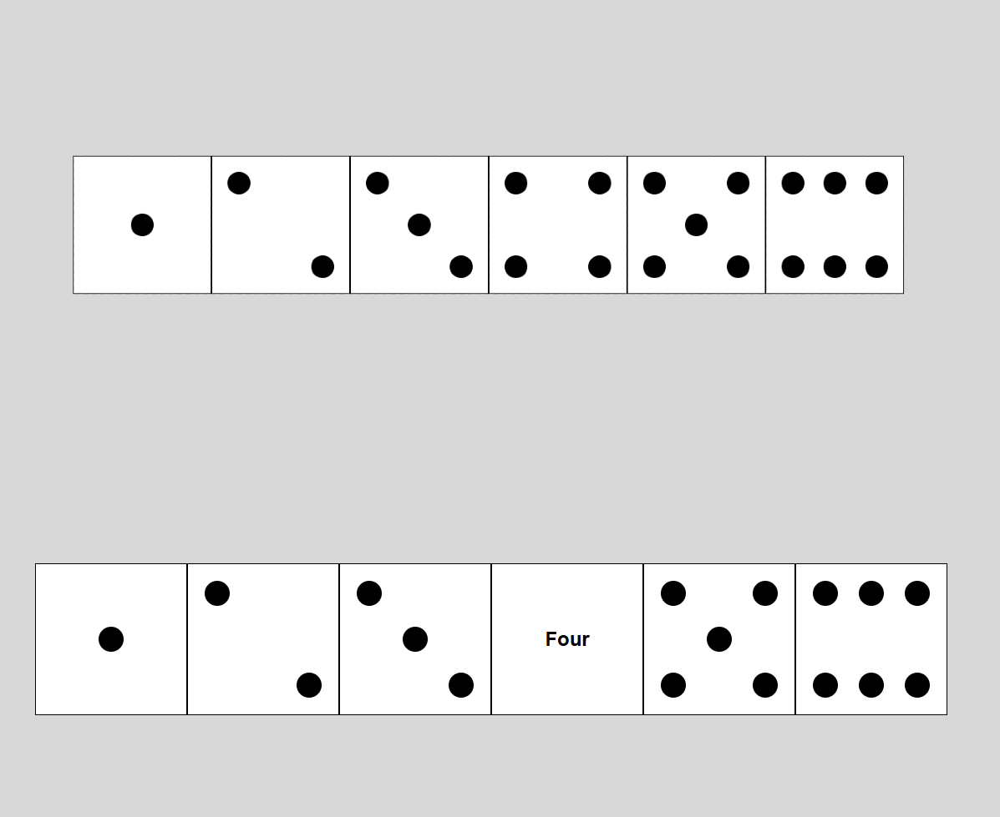

# 
Dice Faces with Hover Text (HTML & CSS)
###
This exercise showcases a simple interactive dice component built with HTML and CSS. All six faces of a standard die (1–6) are visually represented using dots (pips).

Features:
 - Each face of the dice is designed in a separate box showing the correct number of dots.
 - The layout is created using position: relative for the container and position: absolute for the dots, allowing precise placement via top, left, right, and bottom.
 - On hover, the dots disappear and are replaced with the text name of the number (e.g., ONE, TWO, THREE, etc.).
 - Entirely built with pure HTML and CSS, without any JavaScript.

Learning Objectives:
 - Practice using absolute positioning for manual layout control.
 - Learn to apply hover effects using :hover pseudo-classes.
 - Improve CSS skills in visibility toggling and content replacement using basic selectors.

