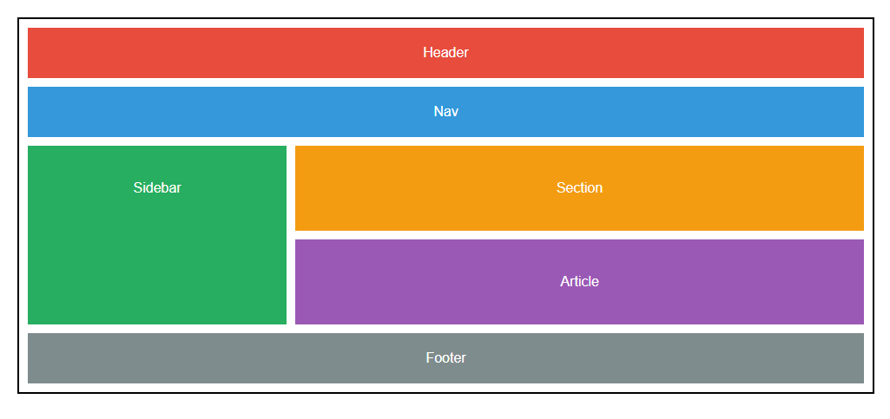

# FlexBox Layout

### 
This exercise demonstrates a basic web layout using HTML5 semantic elements and CSS Flexbox. The goal is to understand and practice using Flexbox to create a responsive and well-structured layout.