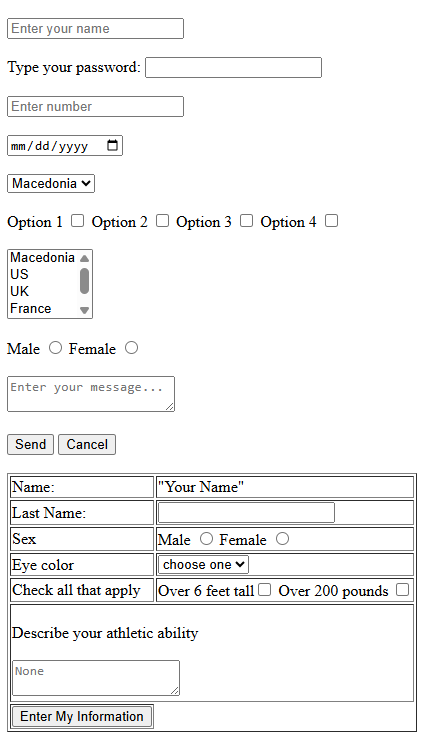

# HTML Form Exercise

This exercise demonstrates how to build a basic user input form using only standard HTML elements — without any CSS or JavaScript.

###
Features:
 - Multiple input types: text, password, number, date, checkboxes, radio buttons, select dropdowns, and textareas.
 - Two separate <form> sections:
   - The first one includes basic user inputs and selection controls.
   - The second one is structured using an HTML <table> for organizing inputs in a form layout.
 - Use of <select> elements with both single and multiple selection (size attribute).
 - Use of semantic form elements such as <label>, <textarea>, and <button>.

Technologies Used:
 - HTML5 (No CSS or JavaScript)

Learning Objectives:
 - Practice working with HTML form elements.
 - Understand how to structure a complex form layout using only HTML.
 - Gain familiarity with organizing form content using an HTML <table>.