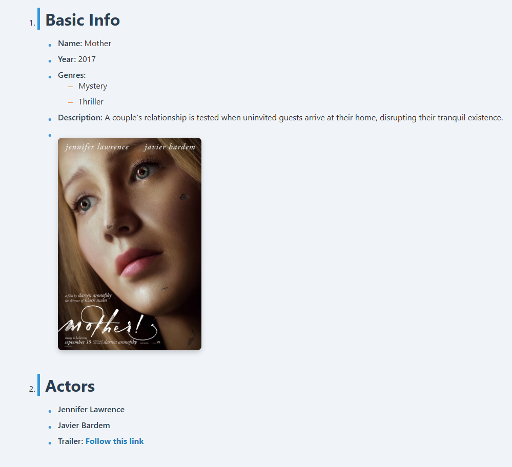

# Movie Info List (HTML & CSS)
This mini-project demonstrates how to structure and style a movie information page using semantic HTML and custom CSS. The layout showcases basic movie details such as title, year, genres, plot, poster, and main actors.

Features:
 - Semantic HTML structure with ordered and unordered lists.
 - Movie poster with alt description for accessibility.
 - External trailer link (opens in a new tab).
 - Stylish and readable list using custom CSS with hover effects and spacing.

Technologies Used:
 - HTML5
 - CSS3 (without Flexbox or Grid)

Preview:
 - Displays a movie layout with titles, nested lists, and image.
 - Clean and responsive presentation with subtle design enhancements.

