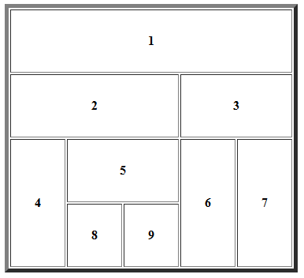

# Table Layout Exercise

This exercise demonstrates how to create a complex table layout using only HTML ```<table>```, ```<tr>```, and ```<th>``` elements, without the use of CSS layout tools like Flexbox or Grid.




Features:
 - Layout built entirely with an HTML ```<table>``` element.
 - Use of colspan and rowspan attributes to control cell sizes and structure.
 - Represents a visually organized grid of numbered blocks (1–9), similar to a puzzle or dashboard.

Technologies Used:
 - HTML5 (No CSS required)

Learning Objective:
 - Practice working with HTML tables.
 - Understand how to merge table cells vertically and horizontally using rowspan and colspan.